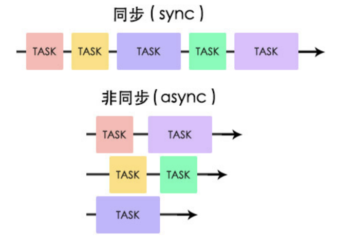
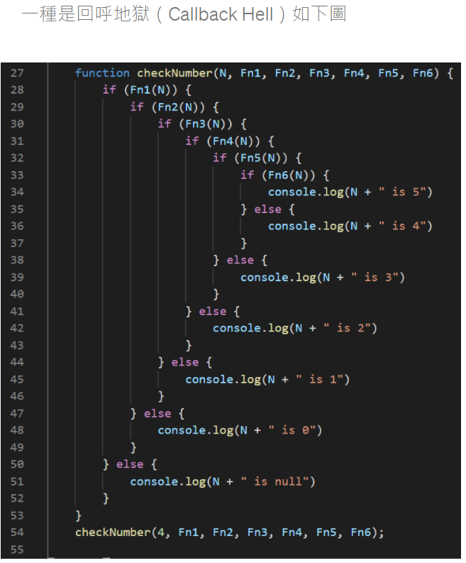
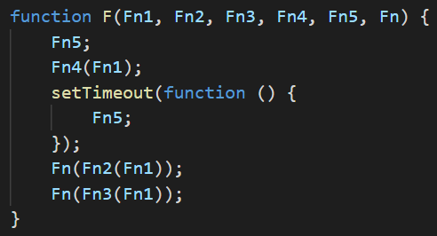
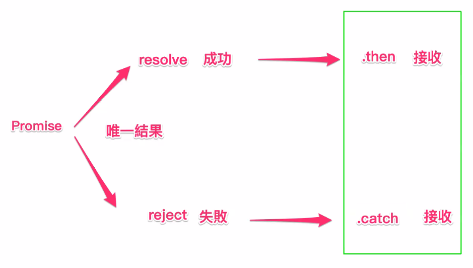
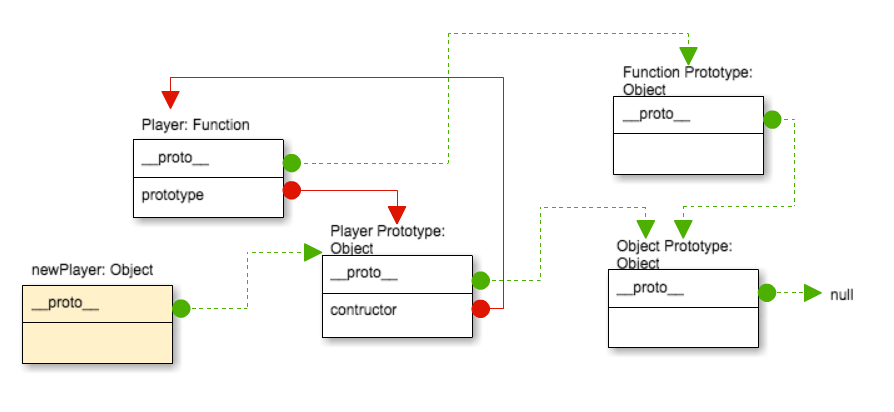

# Javascript note

待學:
1. [Object.defineProperty()](https://developer.mozilla.org/zh-TW/docs/Web/JavaScript/Reference/Global_Objects/Object/defineProperty)
2. [fetch](https://nicolakacha.coderbridge.io/2020/09/11/sync-async/)
3. [w3-bind()](https://www.w3schools.com/js/js_function_bind.asp)
4. [bind](https://realdennis.medium.com/javascript-%E8%81%8A%E8%81%8Acall-apply-bind%E7%9A%84%E5%B7%AE%E7%95%B0%E8%88%87%E7%9B%B8%E4%BC%BC%E4%B9%8B%E8%99%95-2f82a4b4dd66)
5. [this的遺失](https://www.reddit.com/r/learnjavascript/comments/fixrf1/why_is_this_lost_when_a_method_is_used_as_a/)
## 變數範圍
    JavaScript 變數有效範圍的最小單位是以 function 做分界的。

---

## 名詞解釋
- 同步與非同步
    
    [參考網站](https://medium.com/itsems-frontend/javascript-sync-async-22e75e1ca1dc)

    
    - 同步: 一次只做一件事情。
    - 非同步: 同時可以做很多件事情，不需要等到前一件事情做完才做下一件事情。
    > 這個字常常讓人很混淆，同步 "並非" 同步處理多件事 !

    > JavaScript 為 Single-thread，但瀏覽器提供許多非同步方法，讓網頁不會堵塞\
    > Example: 
    > 1. 向 API 發送請求
    > 2. setTimeout(等到時間到了，再將需要發生的事件丟回Javascript)
    > 3. document(為JavaScript與瀏覽器溝通的方法)

- Callback function
    > w3: A callback is a function passed as an argument to another function. \
    This technique allows a function to call another function.\
    A callback function can run after another function has finished

    > 在某一函式執行時或執行後，依條件或依序去執行所傳遞進來的函式。(Callback function 是在指定時機才觸發的function)

    - Why need callback function?
        - 原因: 主程式執行函式時，會有等待的時間或延遲的問題，這樣便會影響到函式的執行順序錯誤的情況發生。
            > Ex. 程式當執行到setTimeout時，會先跳過該程式，把執行的順序優先讓給下一個函式。這樣的好處是其他的函式不會因為需要等待而影響執行的時間。
        - 使用時機: 當一遇到函式需要等待，但其他函式又與該等待的函式有關連時，就會使用CallBack Function的時機點來處理。
        - 缺點:
            1. 多條件的過多層CallBack，會讓整個段函式不易閱讀也不好護維
            
            1. 過多的CallBack function參數及指向，會在閱讀與維護時，尋找程式的主控權步驟變的相當混亂。
            
    - 應用 Example:
        - addEventListener (非同步API)
        - setTimeout
        - Http Request
            - XMLHttpRequest
                ```
                var request = new XMLHttpRequest();
                request.open('GET', 'https://jsonplaceholder.typicode.com/posts/1', true);

                request.onload = function () {
                    if (this.status >= 200 && this.status < 400) {
                        console.log('success');
                    }
                };

                //request.onload 後的function 就是Callback function
                
                request.send();
                ```
            - JQuery 的 ajax
                ```
                $.ajax({
                    url: 'URL',
                    type: 'POST',
                    data: yourData,
                    datatype: 'json'
                })
                .done(function (data) { successFunction(data); })
                .fail(function (jqXHR, textStatus, errorThrown) { serrorFunction(); });
                ```
    - Promise物件
        - A JavaScript Promise object contains both the producing code and calls to the consuming code.
            > "Producing Code" (May take some time)
            > "Consuming Code" (Must wait for a fulfilled Promise)
        
            

        - Syntax:
            ```
            let myPromise = new Promise(function(myResolve, myReject) {
            // "Producing Code" (May take some time)

            myResolve(); // when successful
            myReject();  // when error
            });

            // "Consuming Code" (Must wait for a fulfilled Promise)
            myPromise.then(
            function(value) { /* code if successful */ },
            function(error) { /* code if some error */ }
            );
            ```
        - Example: Waiting for a file
            ```
            let myPromise = new Promise(function(myResolve, myReject) {
            let req = new XMLHttpRequest();
            req.open('GET', "mycar.htm");
            req.onload = function() {
                if (req.status == 200) { //Access success
                myResolve(req.response);
                } else {
                myReject("File not Found");
                }
            };
            req.send();
            });

            myPromise.then(
            function(value) {myDisplayer(value);},
            function(error) {myDisplayer(error);}
            );
            ```
    - IIFE - Immediately Invoked Function Expression [參考網址](https://ithelp.ithome.com.tw/articles/10192739)


## Function rest parameter (傳入任意數量的參數進function)
- 語法:
    function func_name(...args){ }
- Example:
    ```
    function sum(...args){
        let sum = 0;
        for (let arg of args){
            sum += arg;
        }
        return sum;
    }
    let x = sum(1,2,3,4,5,6,7,9);

    console.log(x); //37
    ```

---

## Arrow function (若function只有一行敘述，可以簡寫)
- Example:
    ```
    var hi1 = (x,y) => x * y; //hi1 為一個function

    console.log(hi1(1,2)); //2

    /*同等寫法*/
    var hi2 = function(x,y){ //hi2 為一個function
        return x*y;
    }

    console.log(hi2(1,2)); //2
    ```

---

## Strict mode
- 用途: JS 引擎會用嚴格的標準來讀你的 code，避免你寫出不穩定或不夠嚴謹的 code。
- 語法: 'use strict'
- 使用方式: 
    1. 整支檔案使用: 加在 JS 檔案最前面
    2. 針對某特定 function 使用: 加在 function 內的第一行
- Example:
    - ex1. 
        ```
        'use strict'
        var myName;
        ```
    - ex2.
        ```
        function myName(){
            'use strict'
            var iAm = 'Emma';
        }
        ```
- Strict mode 的限制
    1. `myName = 'Emma'; //直接定義未宣告的變數`
    2. 使用 delete 刪除變數或函式
        ```
        var x = 'x';
        delete x;
        function a() { console.log('hi'); }
        delete a;
        ```
    3. `function a(b, b) { console.log('hi');} //重複變數`
    4. `with (Math){x = cos(2)}; //使用 with`
    5. `var arguments = 3.14; //eval、arguments 不能當作變數名稱`
    6. implements、interface、let、package、private、protected、public、static、yield 不可作為變數名稱
    7. this 禁止指向 global object (在strict mode 會返回 undefined)

        

---

## this
- In JavaScript, the this keyword refers to an "object".
- 在不同情況下，this 代表的物件不同
    1. In an object method, this refers to the object.
    2. Alone, this refers to the global object. (在瀏覽器中，global object 為 window)
    3. In a function, this refers to the global object. (在瀏覽器中，global object 為 window)
    4. In a function, in strict mode, this is undefined.
    5. In an event, this refers to the element that received the event.
        - Example:
            ```
            <button onclick="this.style.display='none'">
            Click to Remove Me!
            </button>
            ```
    6. Methods like call(), apply(), and bind() can refer this to any object.
        - call();
            - 語法: func.call(object, arg1, arg2, ...);
                > 呼叫func函式，而 func函式內的 this 為傳入的 object

                > arg 表其餘傳入的參數
            - Example:
                ```
                const person1 = {
                    fullName: function(city) {
                        return this.firstName + " " + this.lastName + " " + city;
                    }
                }

                const person2 = {
                    firstName:"John",
                    lastName: "Doe",
                }

                let x = person1.fullName.call(person2, taipei); 
                console.log(x); //output: John Doe
                ```
        - apply();
            - 語法: func.apply(object, [arg1, arg2, ...]);

                > The apply() method is similar to the call() method
            
            - Example:
                ```
                let x = person1.fullName.apply(person2, [taipei]);
                // 等同: let x = person1.fullName.call(person2, taipei);
                ```
            
            - 應用:
                ```
                // Example: Since JavaScript arrays do not have a max() method, you can apply the Math.max() method instead.

                // Math.max 使用方式: Math.max(1,2,3);
                Math.max.apply(null, [1,2,3]); // return 3 and first argument does not metter
                ```
                
            
---

## Getter and Setter

[參考網址](https://www.w3schools.com/js/js_object_accessors.asp)

- 用途: access content as a property

- 語法: function 前面加上 get / set 關鍵字

- Why using getter and setter?
    1. It gives simpler syntax
    2. It allows equal syntax for properties and methods
    3. It can secure better data quality
    4. It is useful for doing things behind-the-scenes

- Example:

    ```
    // Create an object:
    const person = {
        firstName: "John",
        lastName: "Doe",
        language: "en",
        get lang() {
            return this.language.toUpperCase();
        },
        set lang(lang){
            this.language = lang;
        }
    };

    console.log(person.lang); //EN

    person.lang = "English";

    console.log(person.lang); //ENGLISH
    ```

---

## Class
- Basic
    - class 的宣告與使用
        ```
        /*宣告*/
        class Person{
            constructor(name){
                this.name = name;
                this.id = undefined;
            }
            static generateIDNumber(){
                return "ID";
            }
        }

        /*使用*/
        const person1 = new Person();
        const person2 = new Person();

        console.log(person1 instanceof Person); //true
        console.log(person2 instanceof Person); //true
        console.log(person1 == person2); //false
        ```
        > instanceof 可以判斷物件是否屬於某類別
        
    - class method 的使用
        ```
        console.log(person1.id); //output: undefined

        person1.name = Person.generateIDNumber(); 
        // person1.name = person1.generateIDNumber(); Wrong! 因為宣告為static 為class所擁有的function

        console.log(person1.name); //output: ID
        ```
        > 宣告為static的function表屬於整個class的function

- Classical inheritance

    [參考網址](https://www.w3schools.com/jsref/jsref_class_super.asp)

    - key: extends.super
    - super 語法小整理:
        1. super(arguments); //calls the parent constructor to get access to the parent's properties and methods(only inside the constructor)
        2. super.parentMethod_name(arguments); //calls a parent method
    - Note:
        1. 子類別的constructor()呼叫super之前，this是沒有指向的，會跑出Reference Error
        2. super也可以用在static method
        3. 若 property 被定義成不可複寫 Ex. Object.defineProperty(this, 'prop', {writable: false,}); 則super不能複寫此屬性
    - Example
        ```
        class Player extends Person{
            constructor(name, level){
                super(name);
                this.level = level; // 如果在super()之前就呼叫this 的話，會reference error
            }
        }
        ```
---

## Object construction & Prototype

- Object construction
    ```
    /*宣告*/
    function Person(firstName, lastName, age, eyeColor){
        // JavaScript methods are the actions that can be performed on objects.
        this.firstName = firstName;
        this.lastName = lastName;
        this.age = age;
        this.eyeColor = eyeColor;
        this.changeName = function(name){
            this.firstName = name;
        };
    }

    /*使用*/
    var person1 = new Person("Peter", "Wu", 17, "black");

    console.log(person1);
    //Output:
    //Person {
    //  firstName: 'Peter',
    //  lastName: 'Wu',
    //  age: 17,
    //  eyeColor: 'black',
    //  changeName: [Function (anonymous)]
    //}

    person1.changeName("EVAN");

    console.log(person1);
    //Output:
    // Person { 
    //   firstName: 'EVAN',
    //   lastName: 'Wu',
    //   age: 17,
    //   eyeColor: 'black',
    //   changeName: [Function (anonymous)]
    //}
    ```

- Prototype-based inheritance

    [參考網址1](https://eyesofkids.gitbooks.io/javascript-start-from-es6/content/part4/prototype.html*/)
    [參考網址2](https://eyesofkids.gitbooks.io/javascript-start-from-es6/content/part4/prototype.html)
    
    prototype: 為一種讓別的物件繼承其中的屬性的物件。

    
    - Note:
        1. Every function has a prototype object.
        2. A function's prototype has a constructor property that references back to the function.
        3. Every Object (include function) has a __proto__ property, points to it's prototype Object of inheritance.
        4. Every Object has a constructor property, points to it's construction function.
        5. JavaScript並沒有對所建立的函式，區分建構函式與一般的函式，所以只要是函式，就一定會有prototype屬性
        6. 函式以外的類型，不會有這個屬性。

    - Use (Adding Properties and Methods to Objects):
        1. Sometimes you want to add new properties (or methods) to all existing objects of a given type.
        2. Sometimes you want to add new properties (or methods) to an object constructor.
        > 原型可以很容易地動態擴充屬性與方法，可以在物件實體化後繼續擴充其中的成員 (以類別為基礎的物件導向，物件實體化後，物件和類別都是無法擴充其中成員，原型物件導向較為彈性)

        > 擴充出來的屬性與方法是所有物件共享的。
    - Example:
        ```
        Person.prototype.nationality = "English"; //add property

        Person.prototype.name = function(){ //add method
            return this.firstName + " " + this.lastName;
        }

        console.log(person1.nationality); //English
        console.log(person1.name()); //EVAN Wu
        console.log(person1);
        //Output: 因為是對其prototype加property與method所以property與method為共用的 發現輸出Object內沒有此 property 和 method
        // Person {
        // firstName: 'EVAN',
        // lastName: 'Wu',
        // age: 17,
        // eyeColor: 'black',
        // changeName: [Function (anonymous)]
        // }

        
        //constructor 對應 note 4.
        console.log(person1.constructor); // [Function: Person]        
        console.log(Person.constructor); // [Function: Function]
        ```
---

